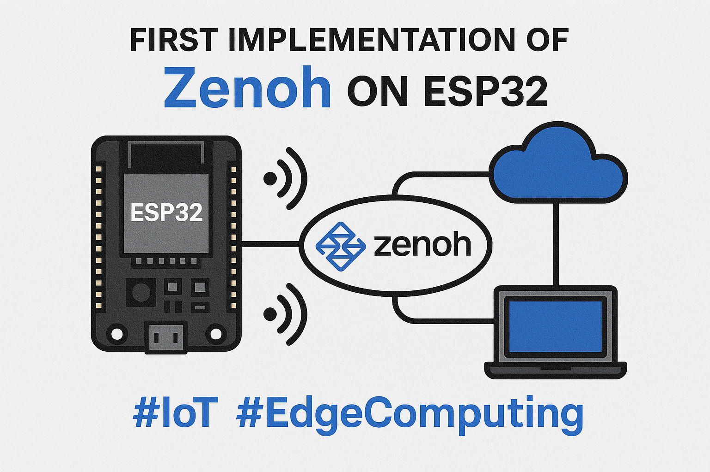
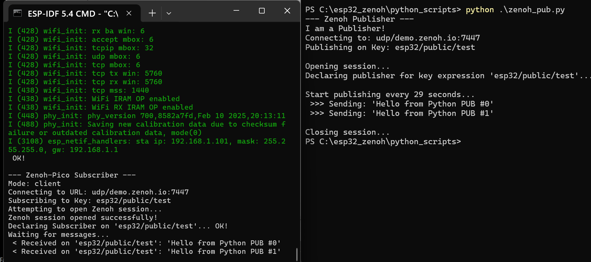
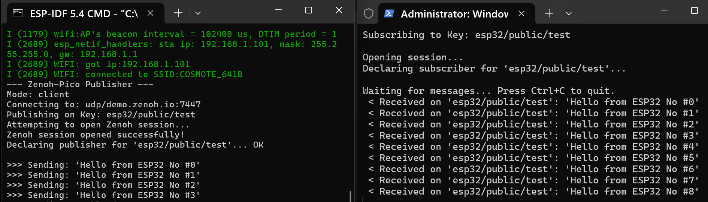

# Zenoh on ESP32: The First Implementation over ESP-IDF (v5.4.1)



**This is the first successful integration of Zenoh-Pico on the ESP32 using the ESP-IDF.** 
I could not find other such working examples online.

This is a fully functional template with all the necessary patches needed for zenoh-pico to be ported over ESP-IDF v5.4.1, for both PUB/SUB over zenoh. Also includes Python scripts for testing.





More about zenoh and zenoh-pico, here [Zenoh-Pico](https://github.com/eclipse-zenoh/zenoh-pico)

More about ESP-IDF, here [ESP-IDF Setup Guide](https://docs.espressif.com/projects/esp-idf/en/latest/esp32/get-started/index.html)

#Zenoh #ESP32 #ESPRESSIF #ESP-IDF #IoT #EdgeComputing #Microcontrollers #FreeRTOS 

# ESP32 Zenoh Project Setup

* **ESP-IDF Environment**: You must have the ESP-IDF development environment installed and configured.
* **Git**: You must have Git installed on your system.

## Prerequisites

- ESP-IDF v5.4.1 installed and configured
- ESP32-S3 board (or compatible, used also ESP32-CAM)
- Git, Python, and required ESP-IDF tools installed

## 1. Create the ESP-IDF Project

How to create a new project named `esp32_zenoh`

1.  **Open the ESP-IDF Command Prompt**
 Open the enabled command prompt for your ESP-IDF version (e.g., **"ESP-IDF 5.x CMD"**).
2.  **Create the Project**
```sh
idf.py create-project esp32_zenoh
```
3.  **Enter the Project Directory**
```sh
cd esp32_zenoh
```

## 2. Install the `zenoh-pico` Component

Next, install the zenoh library as a component
Use `git submodule` to add the `zenoh-pico` library to the project.

1.  **Create the `components` Directory**
From the root of `esp32_zenoh` project, create the directory components (exact name needed).
```sh
mkdir components
```

2.  **Add `zenoh-pico` as a Git Submodule**
Go into the components directory and clone the git repo.
```sh
cd components
git submodule add [https://github.com/eclipse-zenoh/zenoh-pico.git](https://github.com/eclipse-zenoh/zenoh-pico.git)
```

3.  **Initialize the Submodule**
Goto to the project root and run the update command, just in case.
```sh
cd ..
git submodule update --init --recursive
```

## 4. CMakeList.txt

In project root, create the CMakeLists.txt file:
```
cmake_minimum_required(VERSION 3.16)
include($ENV{IDF_PATH}/tools/cmake/project.cmake)
project(zenoh_esp32)
set(CMAKE_C_FLAGS "${CMAKE_C_FLAGS} -DZENOHPICO_PLATFORM_ESP32")
set(CMAKE_C_FLAGS "${CMAKE_C_FLAGS} -DZENOH_ESPIDF")
add_definitions(-DZENOH_FREERTOS_LWIP)
```
the name in `project(zenoh_esp32)` should match the folder name.

in /main folder, add this CMakeList.txt file
```
idf_component_register(SRCS "z_pub.c" "utils/wifi.c"
    INCLUDE_DIRS "." "utils"
    REQUIRES zenoh-pico nvs_flash
	PRIV_REQUIRES esp_event esp_wifi log freertos
)
add_definitions(-DZENOHPICO_PLATFORM_ESP32)
```
**NOTE** Folder 'utils' will hold the wifi connection and the configuration(s).

## 5. /components/zenoh-pico/CMakeList.txt

Make sure you substitute the file /components/zenoh-pico/CMakeList.txt with the follwoing (the original creates alot of errors!)

```
# Find all the common source files
file(GLOB_RECURSE PICO_SRCS_COMMON
    "src/api/*.c"
    "src/collections/*.c"
    "src/link/*.c"
    "src/net/*.c"
    "src/protocol/*.c"
    "src/session/*.c"
    "src/transport/*.c"
    "src/utils/*.c"
    "src/system/common/*.c"
)

# Find the platform-specific files for FreeRTOS + LWIP (used by ESP-IDF)
file(GLOB_RECURSE PICO_SRCS_PLATFORM
    "src/system/freertos/lwip/*.c"
    "src/system/freertos/system.c"
)

# Combine the lists of common and platform-specific files
list(APPEND PICO_SRCS_COMMON ${PICO_SRCS_PLATFORM})

# Register the component with the specific source files.
idf_component_register(SRCS ${PICO_SRCS_COMMON}
                    INCLUDE_DIRS "include"
                    REQUIRES freertos lwip)

# Add all compile definitions to the correct __idf_zenoh-pico component target
target_compile_definitions(__idf_zenoh-pico PUBLIC
    ZENOH_FREERTOS_LWIP
    Z_LOG_LEVEL_DEFAULT=Z_LOG_LEVEL_TRACE
    # Definitions for memory and timeout fix
	Z_FRAG_MAX_SIZE=1024   
    Z_BATCH_UNICAST_SIZE=1024
    Z_BATCH_MULTICAST_SIZE=1024
 	Z_CONFIG_SOCKET_TIMEOUT=5000
)
```

## 6. MOST IMPORTANT: config.h

file /components/zenoh-pico/include/zenoh-pico/config.h
**MUST ALTER**
```
#define Z_FRAG_MAX_SIZE 4096
#define Z_BATCH_UNICAST_SIZE 2048
#define Z_BATCH_MULTICAST_SIZE 2048
#define Z_CONFIG_SOCKET_TIMEOUT 5000
```
*MOST IMPORTANT* seems to be the line `Z_CONFIG_SOCKET_TIMEOUT 100`from 100 to 5000. **LATER ADDITION: It seems to work with #define Z_CONFIG_SOCKET_TIMEOUT 1000**. Feel free to experiment with shorter values, but definitely much bigger than the initial 100. Moreover, it mentions in the config.h `"*pass values to CMake to change the following tokens*"`, so feel free to pass them via CMake.

## 7. UDP vs TCP

zenoh can listen to both UDP and TCP. The only line you need to change is

`#define LOCATOR "udp/demo.zenoh.io:7447"`

to

`#define LOCATOR "tcp/demo.zenoh.io:7447"`

Make sure that the server is working (the zenoh people kindly enabled during the writing of this project, thank you!). The easiest way to test is `telnet demo.zenoh.io:7447`. If it stays connected, it works.
If you have DHCP issues with `demo.zenoh.io`, switch to IP address of it. 

Running the ESP on the IP address of the computer where you will run the subscriber.py script.
- On Windows: Open Command Prompt and type ipconfig.
- On macOS/Linux: Open a terminal and type ifconfig or ip a.

# 8. Other Alterations (compilation errors)

File: components\zenoh-pico\include\zenoh-pico\system\platform\freertos\lwip.h

Alter by adding "freertos/" in front of any include "not found"
```
// George
#include "freertos/FreeRTOS.h"
#include "lwip/sockets.h"
#include "freertos/semphr.h"

#ifdef __cplusplus
extern "C" {
#endif

#if Z_FEATURE_MULTI_THREAD == 1
// George
#include "freertos/event_groups.h"
```

in file /components/zenoh-pico/src/system/freertos/lwip/network.c

alter the 

`#include "FreeRTOS.h"` 

to 

`#include "freertos/FreeRTOS.h"`

File \components\zenoh-pico\src\system\freertos\system.c

Add in line ~49

`static portMUX_TYPE task_mux = portMUX_INITIALIZER_UNLOCKED;`

Line ~151
```
    // George
    taskENTER_CRITICAL(&task_mux);
    if (task->handle != NULL) {
        vTaskDelete(task->handle);
        task->handle = NULL;
    }
    // George
    taskEXIT_CRITICAL(&task_mux);
```
Line ~168
```
    // George
    taskENTER_CRITICAL(&task_mux);
    if (task->handle != NULL) {
        vTaskDelete(task->handle);
        task->handle = NULL;
    }
    // George
    taskEXIT_CRITICAL(&task_mux);
```

File components/zenoh-pico/src/system/freertos/lwip/network.c

replace:

`inet_addr_from_ip4addr(&lsockaddr_in->sin_addr, ip_2_ip4(ip4_addr));`

with

`inet_addr_from_ip4addr(&lsockaddr_in->sin_addr, ip4_addr);`

Errors of not finding libraries like this `#include "FreeRTOS.h"`, replace with `#include "freertos/FreeRTOS.h"`

## 9. Zenoh Debugging

Run `idf.py menuconfig`

Go to Component config ---> Log output ---> Set Default log verbosity to Debug or Info.

Go to Component config ---> LWIP ---> Enable LWIP DEBUG.

Inside the LWIP DEBUG menu, enable TCP & UDP Debug (CONFIG_LWIP_TCP_DEBUG).

**BE CAREFUL:** Flood of messages, could crash.

## 10. Build and Run

**MUST DO:** Go to folder `main/utils`, rename the file `secret.h.template` to `secret.h` and fill the wifi credentials (SSID, password).

the `/main` folder has two files: `z_pub.c`, `z_sub.c`. You can choose which one to run by altering the first line of the `main/CMakeList.txt` file. By defauit it runs the `z_pub.c`.

Configure the target chip and build the project

1.  **Set the Target Chip** (e.g., for a standard ESP32)
    ```sh
    idf.py set-target esp32
    ```
If you switch chips, it will complain, you have to run it again.

2.  **Build & Flash**
    ```sh
    idf.py fullclean build flash monitor -p COMXX
    ```

You can run the python scripts to establish ping/pong (PUB/SUB).
Feel free to use for non-commercial apps.